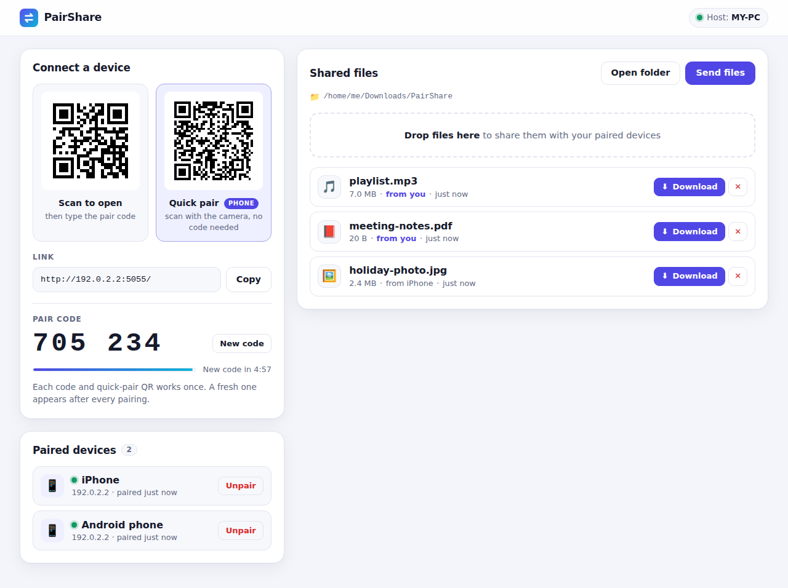
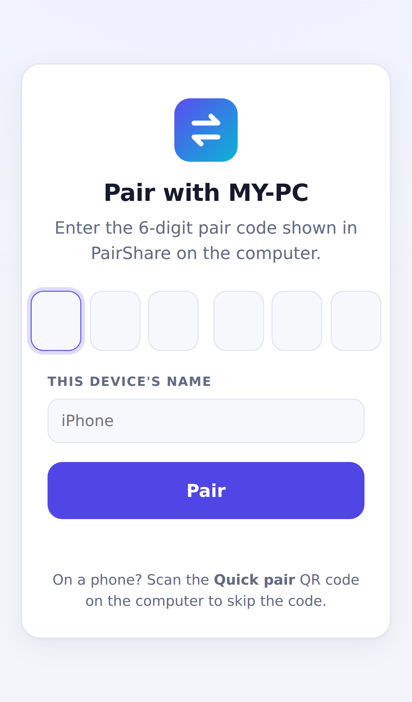
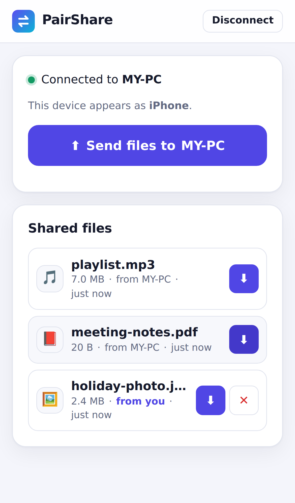

# PairShare

Share files between your computer and your phone (or any other device) over Wi‑Fi.
There's nothing to install on the phone, because it just uses the browser.

PairShare is a **C# / .NET 8** app. It runs on the computer, starts a small web server
on your local network, and gives you three ways to connect a device:

| | How | What happens |
|---|---|---|
| **Link** | Type or paste `http://<your-pc-ip>:5050` into any browser | Opens the web app, then asks for the pair code |
| **QR code** | Scan the "Scan to open" QR code | Same as the link, then enter the pair code |
| **Quick pair** | Scan the "Quick pair" QR code with a phone camera | Paired instantly, with no code to type |

Once a device is paired, **either side can send files**: the computer to the phone, the phone to
the computer, or one phone to another. Everyone who is paired sees the shared file list update
live.



<p>
  
  &nbsp;
  
</p>

## Download

Grab the latest version from the **[Releases page](https://github.com/j4522419-code/project6/releases/latest)**.
Pick the zip for your computer (Windows, Mac or Linux), unzip it and run **PairShare**. .NET is
built in, so there's nothing else to install.

## Running from source

You need the [.NET 8 SDK](https://dotnet.microsoft.com/download) (or newer) on the computer.

```bash
dotnet run --project src/PairShare
```

The console prints the link, the current pair code and a QR code, and the host dashboard opens
in your browser at `http://localhost:5050`. Keep that window open while you're sharing.

```
  PairShare is running on MY-PC

  Dashboard  http://localhost:5050/
  Link       http://192.168.1.23:5050/
  Pair code  482 913   (single-use; the dashboard always shows the current one)
  Folder     C:\Users\me\Downloads\PairShare

  Scan this with your phone to open PairShare:
  ▄▄▄▄▄▄▄ ▄ ▄▄ ...
```

**On your phone** (it must be on the same Wi‑Fi):

1. Scan **Quick pair** with the camera and you're done. *Or* scan **Scan to open** / type the link,
   then enter the 6‑digit pair code.
2. Tap **Send files to …** to send files to the computer, or tap **Download** on anything shared.

On the computer, drag files onto the dashboard (or click **Send files**) to share them with your
devices. Everything that is shared lives in one folder (`Downloads/PairShare` by default), so files
from your phone land there, and anything you copy into that folder is shared too.

### Options

```
dotnet run --project src/PairShare -- --port 6000 --dir D:\Shared
```

| Option | Default | Meaning |
|---|---|---|
| `--port <n>` | `5050` | Port to listen on |
| `--dir <path>` | `~/Downloads/PairShare` | The shared folder |
| `--address <ip>` | auto‑detected | Address to put in the link and QR codes (if auto-detect picks the wrong network adapter) |
| `--code-minutes <n>` | `5` | How long a pair code / quick-pair QR stays valid |
| `--max-upload-mb <n>` | `4096` | Largest file a device can send |
| `--no-browser` | | Don't open the dashboard automatically |

If the computer has several network adapters (VPN, virtual machines…), the dashboard shows a
**Network address** picker so you can choose which address the QR codes use.

### Make a standalone .exe

```bash
dotnet publish src/PairShare -c Release -r win-x64 --self-contained -p:PublishSingleFile=true -o publish
```

`publish/PairShare.exe` runs on any Windows PC without .NET installed, and the web UI is built
into the exe. Use `-r osx-arm64`, `-r osx-x64` or `-r linux-x64` for other systems.

### Troubleshooting

- **Phone can't open the link.** Both devices must be on the same network. Guest Wi‑Fi and some
  public networks block devices from reaching each other.
- **Windows asks about the firewall on first run.** Allow access on **private** networks.
  If you dismissed it, allow `PairShare` (or `dotnet`) in *Windows Security → Firewall → Allow an app*.
- **"Address already in use".** PairShare is already running, or another app uses the port.
  Start it with `--port 6000`.
- **Wrong IP in the QR code.** Pick another address in the dashboard, or start with `--address`.

## How pairing works

```
 phone                                   computer (PairShare)
   │  GET /            ───────────────▶  not paired → pair page
   │  POST /api/pair {code}  ─────────▶  code correct? → new device session
   │  ◀──────────── session cookie  ────  (code is replaced right away)
   │  GET /api/files, POST /api/files ─▶  allowed with the cookie
   │  GET /api/events  ◀── live updates (Server-Sent Events)
```

- The **computer itself** (requests from `localhost`) is the host. It sees the dashboard and never needs a code.
- **Pair codes** are 6 random digits. **Quick-pair QR codes** hold a 128-bit random token.
  Both are **single-use**: a new one is generated the moment a device pairs, when the timer
  runs out, or when you click **New code**. The dashboard updates live.
- **Wrong codes are rate-limited**: 5 wrong tries locks that device out for a minute, and a code that
  collects 20 wrong guesses is thrown away.
- Paired devices get a random session token in an `HttpOnly` cookie. **Unpair** on the dashboard
  (or **Disconnect** on the phone) revokes it instantly. Restarting PairShare unpairs everyone.
- A device can remove the files it sent. The computer can remove anything.

### Security notes

PairShare is meant for your home or office network:

- Traffic is plain **HTTP on your local network**, so it isn't encrypted. Don't use it on
  networks you don't trust.
- Don't expose the port to the internet or put PairShare behind a reverse proxy. It trusts
  requests from `localhost` as the host.
- Built-in hardening: uploaded file names are sanitized (no `../` tricks, no reserved Windows names,
  no hidden right-to-left tricks), downloads are always sent as attachments, state-changing API calls
  need a custom header (blocks cross-site request forgery), unknown `Host` headers are refused
  (blocks DNS rebinding), and every page ships with a strict Content-Security-Policy.

## Project layout

```
src/PairShare/
  Program.cs              startup: options, services, middleware
  Endpoints.cs            all HTTP routes (pages, pairing, files, live events, host-only API)
  RequestGuard.cs         security headers, Host check, CSRF header check
  Banner.cs               console output with the terminal QR code
  Services/
    PairingService.cs     pair codes, quick-pair tokens, rate limiting
    DeviceRegistry.cs     paired devices and their session tokens
    FileStore.cs          the shared folder (streaming uploads, folder watcher)
    FileNames.cs          safe file names
    EventHub.cs           Server-Sent Events fan-out
    NetworkInfo.cs        finds the LAN address to put in links / QR codes
    Qr.cs                 QR codes as SVG and as terminal block characters (QRCoder)
  wwwroot/
    pages/                host.html (dashboard), pair.html, app.html (device)
    assets/               app.css, common.js, host.js, pair.js, device.js
tests/PairShare.Tests/    unit tests + in-memory API tests (xUnit)
```

## Tests

```bash
dotnet test
```

## Making a release

Push a version tag. The [Release workflow](.github/workflows/release.yml) runs the tests, builds
single-file apps for Windows (x64/ARM64), macOS (Apple silicon/Intel) and Linux, and publishes
them as a GitHub Release. Notes come from `docs/release-notes/<tag>.md` if that file exists.

```bash
git tag v1.0.1
git push origin v1.0.1
```
